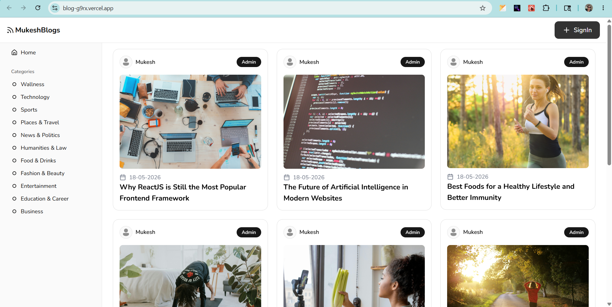
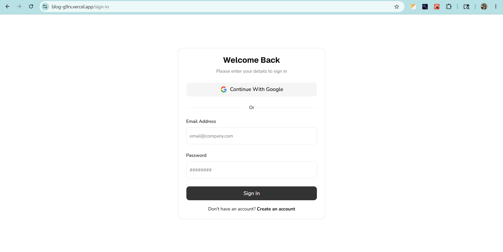
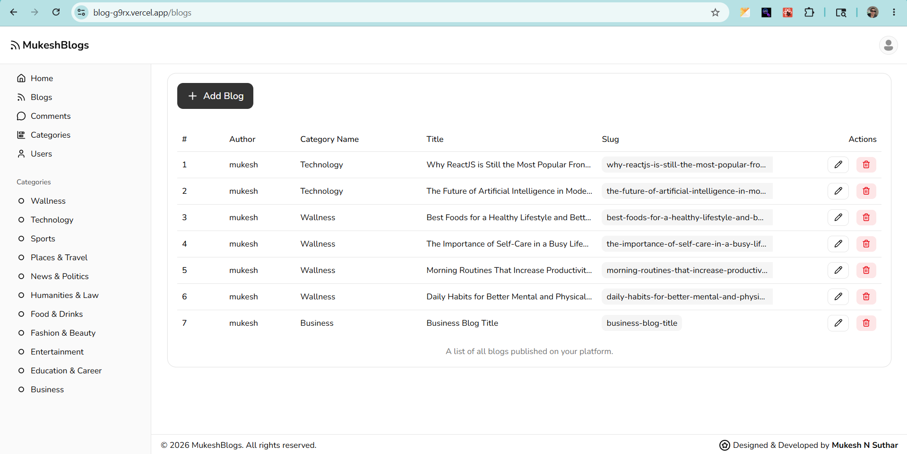
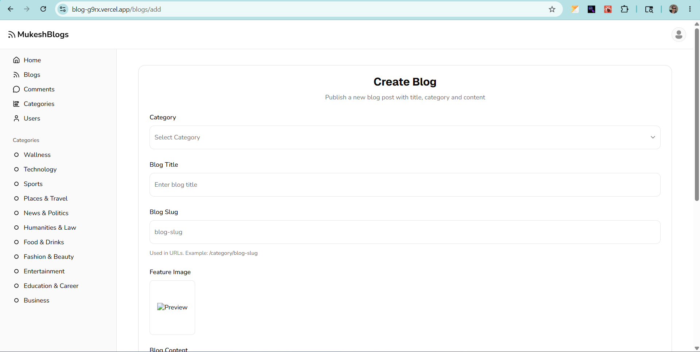
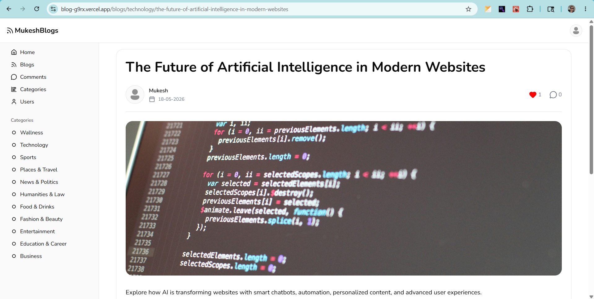
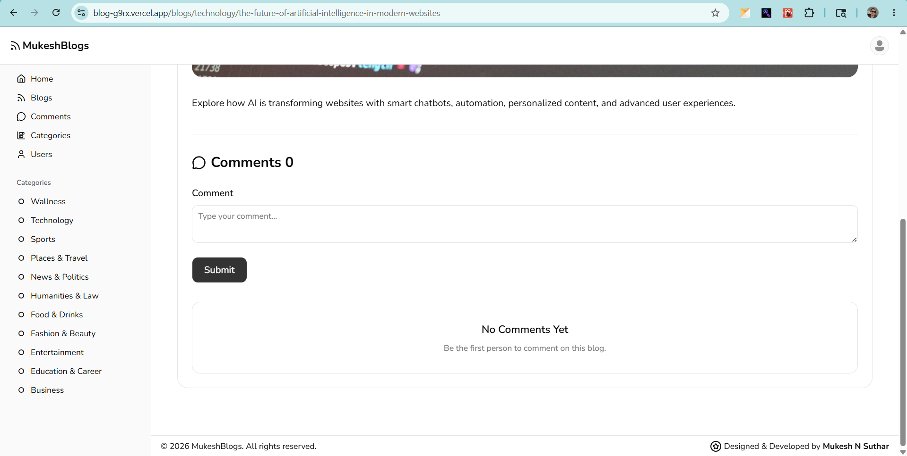

# 🚀 Full Stack Blog Application

A modern and scalable Full Stack Blog Application built using the MERN Stack.

This project was created while learning backend development with Node.js and Express.js, focusing on real-world features like authentication, blog management, image uploads, comments, likes, and user profile management.

The application includes both frontend and backend implementation with secure authentication, REST APIs, Cloudinary integration, Firebase Google Authentication, and MongoDB database management.

> This project was built as a hands-on learning project to strengthen my full-stack development skills using the MERN stack.

---

# 📸 Project Preview

## 🏠 Home Page



---

## 🔐 Login Page



---

## 📊 Dashboard



---

## ✍️ Create Blog Page



---

## 📖 Blog Details Page





---

# ✨ Features

## 🔐 Authentication

* User Registration
* User Login
* Google Authentication
* JWT Authentication
* Secure HTTP-Only Cookies
* Logout Functionality
* Protected Routes

---

## 👤 User Features

* Update Profile
* Upload Avatar
* Change Password
* User Bio
* Get Single User
* Get All Users
* Delete User

---

## 📝 Blog Features

* Create Blog
* Update Blog
* Delete Blog
* Get All Blogs
* Get Blog Details
* Get Blog By Slug
* Category Based Blogs
* Rich Text Content
* Feature Image Upload
* SEO Friendly Slug

---

## 📂 Category Features

* Add Category
* Update Category
* Delete Category
* Get All Categories
* Get Single Category

---

## 💬 Comment Features

* Add Comment
* Delete Comment
* Get All Comments
* Comment Count

---

## ❤️ Like Features

* Add/Remove Like
* Like Count System

---

## ☁️ Cloud Features

* Cloudinary Image Upload
* MongoDB Atlas Database
* Firebase Google Authentication
* Vercel Deployment

---

# 🛠️ Tech Stack

## Frontend

* ReactJS
* React Router DOM
* Redux Toolkit
* Shadcn UI
* Tailwind CSS
* Axios
* Firebase Authentication
* React Hot Toast
* Lucide React Icons
* Moment.js
* React Dropzone
* Zod
* Custom Hooks

---

## Backend

* Node.js
* Express.js
* MongoDB
* Mongoose
* JWT Authentication
* BcryptJS
* Cookie Parser
* Multer
* Cloudinary
* CORS
* dotenv

---

# 📁 Project Structure

```bash
blog/
│
├── client/                     # Frontend
│   ├── public/
│   ├── src/
│   ├── .env
│   ├── vercel.json
│   └── package.json
│
├── server/                     # Backend
│   ├── api/
│   ├── config/
│   ├── controllers/
│   ├── helpers/
│   ├── middlewares/
│   ├── models/
│   ├── routes/
│   ├── uploads/
│   ├── .env
│   ├── app.js
│   ├── server.js
│   ├── vercel.json
│   └── package.json
│
├── screenshots/                # README screenshots
│
└── README.md
```

---

# ⚙️ Environment Variables

## Frontend `.env`

Create a `.env` file inside the `client` folder.

```env
VITE_API_URL=YOUR_BACKEND_URL
VITE_FIREBASE_API_KEY=YOUR_FIREBASE_API_KEY
VITE_FIREBASE_AUTH_DOMAIN=YOUR_FIREBASE_AUTH_DOMAIN
VITE_FIREBASE_PROJECT_ID=YOUR_FIREBASE_PROJECT_ID
VITE_FIREBASE_STORAGE_BUCKET=YOUR_FIREBASE_STORAGE_BUCKET
VITE_FIREBASE_MESSAGING_SENDER_ID=YOUR_FIREBASE_MESSAGING_SENDER_ID
VITE_FIREBASE_APP_ID=YOUR_FIREBASE_APP_ID
```

---

## Backend `.env`

Create a `.env` file inside the `server` folder.

```env
PORT=3000
MONGODB_URL=YOUR_MONGODB_CONNECTION_STRING
JWT_SECRET=YOUR_SECRET_KEY
CLOUDINARY_CLOUD_NAME=YOUR_CLOUD_NAME
CLOUDINARY_API_KEY=YOUR_API_KEY
CLOUDINARY_API_SECRET=YOUR_API_SECRET

NODE_ENV=production
```

---

# 🔥 Firebase Setup

```bash
1. Go to Firebase Console.
2. Create a new project.
3. Enable Google Authentication.
4. Copy Firebase configuration keys.
5. Paste them into the frontend `.env` file.
```

---

# ☁️ Cloudinary Setup

```bash
1. Create an account on Cloudinary.
2. Open Dashboard.
3. Copy:
   * Cloud Name
   * API Key
   * API Secret
4. Paste them into backend `.env`.
```

---

# 🍃 MongoDB Atlas Setup

```bash
1. Create a MongoDB Atlas cluster.
2. Create a database user.
3. Whitelist your IP address.
4. Copy MongoDB connection string.
5. Paste it into:
```

```env
MONGODB_URL=YOUR_CONNECTION_STRING
```

---

# 📦 Installation & Setup

## 1️⃣ Clone Repository

```bash
git clone https://github.com/mukeshh24/blog.git
```

---

## 2️⃣ Install Frontend Dependencies

```bash
cd client
npm install
```

---

## 3️⃣ Install Backend Dependencies

```bash
cd server
npm install
```

---

# ▶️ Run Project Locally

## Run Frontend

```bash
cd client
npm run dev
```

---

## Run Backend

```bash
cd server
npm run dev
```
---

# 🚀 Deployment

## Frontend Deployment (Vercel)

```bash
1. Push code to GitHub.
2. Import project into Vercel.
3. Add frontend environment variables.
4. Deploy project.
```

---

## Backend Deployment (Vercel)

```bash
1. Import backend folder into Vercel.
2. Add backend environment variables.
3. Deploy backend.
4. Copy deployed backend URL.
5. Update:
```

```env
VITE_API_URL=YOUR_BACKEND_URL
```
---

# 📄 License

This project is licensed under the MIT License.

---

# 👨‍💻 Author

## Mukesh N Suthar

Frontend Developer | ReactJS Developer | MERN Stack Developer

### 🔗 Connect With Me

- LinkedIn: https://www.linkedin.com/in/mukesh-sutharr/
- GitHub: https://github.com/mukeshh24

---